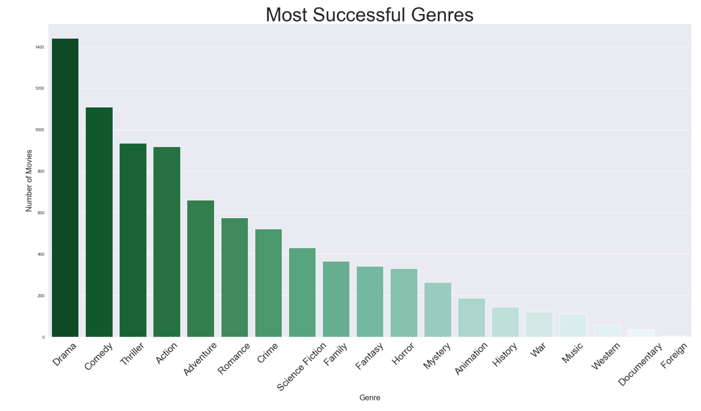

# Example Plot with pyplot

``` python
import matplotlib.pyplot as plt
plt.plot(grouped['profit_percentage'], label='Profit Percentage')
#plt.title('Profit Percentage',fontsize=24)
plt.xlabel('Year',fontsize=20)
plt.ylabel('Profit Percentage',fontsize=20)
#plt.legend(title='Profit Percentage', fontsize=20)
plt.legend(fontsize=20)
plt.show()
```

# Another Example

``` python
import pandas as pd
import matplotlib.pyplot as plt

#create data
df = pd.DataFrame({'points': [11, 17, 16, 18, 22, 25, 26, 24, 29],
                   'assists': [5, 7, 7, 9, 12, 9, 9, 4, 8]})

#add lines to plot
plt.plot(df['points'], label='Points')
plt.plot(df['assists'], label='Assists')

#add legend
plt.legend()

#add title to legend
plt.legend(title='Metric')

#add title to legend with increased font size
plt.legend(title='Metric', title_fontsize=25)

#add title to legend with increased title and label font size
plt.legend(title='Metric', title_fontsize=25, fontsize=15)
```
 

# SNS Example

``` python
plot = sns.countplot(data = movies_df, x = movies_df.genres.explode(), 
                     order = genres_exploded.value_counts().index, palette = "BuGn_r")

sns.set(rc={'figure.figsize':(30,15)})
plot.set_title("Most Successful Genres",fontsize=50)
plot.set_xlabel("Genre",fontsize=20)
plot.set_ylabel("Number of Movies",fontsize=20)
plot.set_xticklabels(plot.get_xticklabels(), rotation=45, fontsize=25)
```